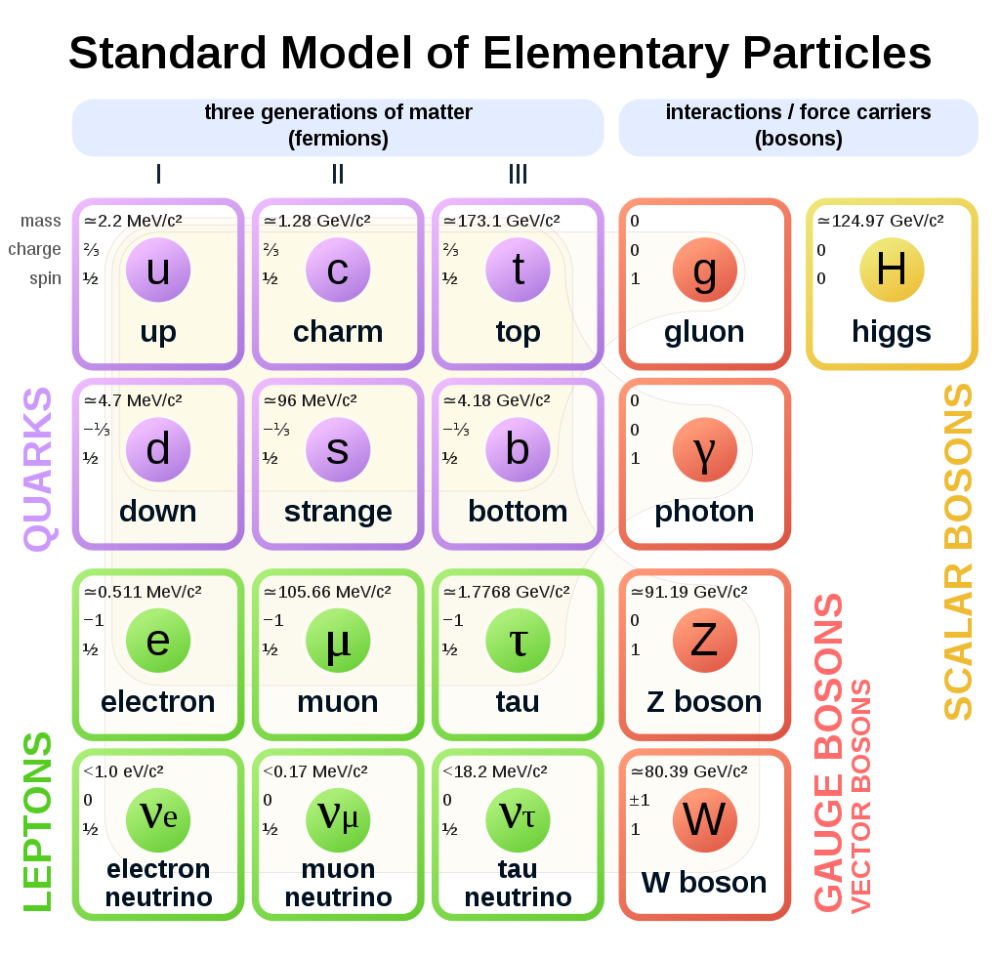

---
https://en.wikipedia.org/wiki/Standard_Model
https://en.wikipedia.org/wiki/Quark#Classification
---

# Elementary Particles

## The Standard Model

The Standard Model of particle physics is the theory describing three of the four known fundamental forces (the electromagnetic, weak, and strong interactions, and not including the gravitational force) in the universe, as well as classifying all known elementary particles. It was developed in stages throughout the latter half of the 20th century, through the work of many scientists around the world, with the current formulation being finalized in the mid-1970s upon experimental confirmation of the existence of quarks. Since then, confirmation of the top quark (1995), the ==tau neutrino (2000)==, and the ==Higgs boson (2012)== have added further credence to the Standard Model. In addition, the Standard Model has predicted various properties of ***weak neutral currents*** and the ==W and Z bosons== with great accuracy.

## Quarks

A quark is a type of elementary particle and a fundamental constituent of matter. Quarks combine to form composite particles called ***hadrons***, the most stable of which are protons and neutrons, the components of atomic nuclei. Due to a phenomenon known as ==color confinement==, quarks are never found in isolation; they can be found only within hadrons, which include baryons (such as protons and neutrons) and mesons, or in ==quark–gluon plasmas==. For this reason, much of what is known about quarks has been drawn from observations of hadrons.

The Standard Model is the theoretical framework describing all the currently known elementary particles. This model contains six flavors of quarks (q) named:

- up (u)
- down (d)

- strange (s)
- charm (c)

- bottom (b)
- top (t).

Up and down quarks have the lowest masses of all quarks. The heavier quarks rapidly change into up and down quarks through a process of ==particle decay==: the transformation from a higher mass state to a lower mass state. Because of this, up and down quarks are generally stable and the most common in the universe, whereas strange, charm, bottom, and top quarks can only be produced in high energy collisions (such as those involving cosmic rays and in particle accelerators). For every quark flavor there is a corresponding type of antiparticle, known as an antiquark, that differs from the quark only in that some of its properties (such as the electric charge) have equal magnitude but opposite sign.

>**Note:** Antiparticles of quarks are called antiquarks, and are denoted by a bar over the symbol for the corresponding quark, such as  for an up antiquark. As with antimatter in general, antiquarks have the same mass, mean lifetime, and spin as their respective quarks, but the electric charge and other charges have the opposite sign.

Six of the particles in the Standard Model are quarks (shown in purple). Each of the first three columns forms a generation of matter.

**Composition:** Elementary particle

**Antiparticle:** Antiquark (; q;)

**Electric charge:** +​2⁄3 e, −​1⁄3 e

## Definitions

**Flavor**
: In particle physics, *flavour* or *flavor* refers to the species of an elementary particle. The Standard Model counts six flavors of quarks and six flavors of leptons. They are conventionally parameterized with flavour quantum numbers that are assigned to all subatomic particles. They can also be described by some of the family symmetries proposed for the quark-lepton generations.

**Hadron**
: In particle physics, a hadron (Greek: ἁδρός, hadrós; "stout, thick") is a subatomic composite particle made of two or more quarks held together by the strong force in a similar way as molecules are held together by the electromagnetic force. Most of the mass of ordinary matter comes from two hadrons: the proton and the neutron.

  Hadrons are categorized into two families: *baryons*, made of an odd number of quarks – usually three quarks – and *mesons*, made of an even number of quarks—usually one quark and one antiquark.

  >*Protons* and **neutrons are examples of baryons; *pions* are an example of a meson.

**Pion**
: In particle physics, a pion (or a pi meson, denoted with the Greek letter pi: π ) is any of three subatomic particles: π0, π+, and π−. Each pion consists of a quark and an antiquark and is therefore a meson. Pions are the lightest mesons and, more generally, the lightest hadrons. They are unstable, with the charged pions π+ and π− decaying after a mean lifetime of 26.033 nanoseconds (2.6033×10−8 seconds), and the neutral pion π0 decaying after a much shorter lifetime of 84 attoseconds (8.4×10−17 seconds). Charged pions most often decay into muons and muon neutrinos, while neutral pions generally decay into gamma rays.

  The exchange of virtual pions, along with ==vector, rho and omega mesons==, provides an explanation for the residual strong force between nucleons. Pions are **not** produced in radioactive decay, but commonly are in high energy collisions between hadrons.
  
  Pions also result from some matter-antimatter annihilation events.
  
  All types of pions are also produced in natural processes when high energy cosmic ray protons and other hadronic cosmic ray components interact with matter in Earth's atmosphere. In 2013, the detection of characteristic gamma rays originating from the decay of neutral pions in two supernova remnants has shown that pions are produced copiously after supernovas, most probably in conjunction with production of high energy protons that are detected on Earth as cosmic rays.

  The concept of mesons as the carrier particles of the nuclear force was first proposed in 1935 by Hideki Yukawa. While the ==muon== was first proposed to be this particle after its discovery in 1936, later work found that it did not participate in the strong nuclear interaction. The pions, which turned out to be examples of Yukawa's proposed mesons, were discovered later: the charged pions in 1947, and the neutral pion in 1950.

**Quantization**
: In physics, *quantization (quantisation)* is the process of transition from a classical understanding of physical phenomena to a newer understanding known as quantum mechanics. (It is a procedure for constructing a quantum field theory starting from a classical field theory.) This is a generalization of the procedure for building quantum mechanics from classical mechanics. Also related is field quantization, as in the "quantization of the electromagnetic field", referring to photons as field "quanta" (for instance as light quanta).

**Quantum Numbers**
: In chemistry and quantum physics, quantum numbers describe values of conserved quantities in the dynamics of a quantum system. In the case of electrons, the quantum numbers can be defined as "the sets of numerical values which give acceptable solutions to the Schrödinger wave equation for the hydrogen atom". In more general cases, quantum numbers correspond to eigenvalues of operators that commute with the Hamiltonian—quantities that can be known with precision at the same time as the system's energy *note 1*—and their corresponding eigenspaces. Together, a specification of all of the quantum numbers of a quantum system fully characterize a basis state of the system, and can in principle be measured together.
  >**Note 1:**  specifically, observables  that commute with the Hamiltonian are simultaneously diagonalizable with it and so the eigenvalues  and the energy (eigenvalues of the Hamiltonian) are not limited by an uncertainty relation arising from non-commutativity.

**Weak Neutral Currents**
: Weak neutral current interactions are one of the ways in which subatomic particles can interact by means of the weak force. These interactions are mediated by the Z boson. The discovery of weak neutral currents was a significant step toward the unification of electromagnetism and the weak force into the electroweak force, and led to the discovery of the W and Z bosons.

   The weak force is best known for its role in nuclear decay. It has very short range but (apart from gravity) is the only force to interact with neutrinos. The weak force is communicated via exchange particles like other subatomic forces. Perhaps the most well known of the exchange particles for the weak force is the W particle which is involved in beta decay. W particles have electric charge – there are both positive and negative W particles – however the Z boson is also an exchange particle for the weak force but does not have any electrical charge. Exchange of a Z boson transfers momentum, spin, and energy, but leaves the interacting particles’ quantum numbers unaffected – charge, flavor, baryon number, lepton number, etc. Because there is no transfer of electrical charge involved, exchange of Z particles is referred to as “neutral” in the phrase “neutral current”. However the word “current” here has nothing to do with electricity – it simply refers to the exchange of the Z particle.
